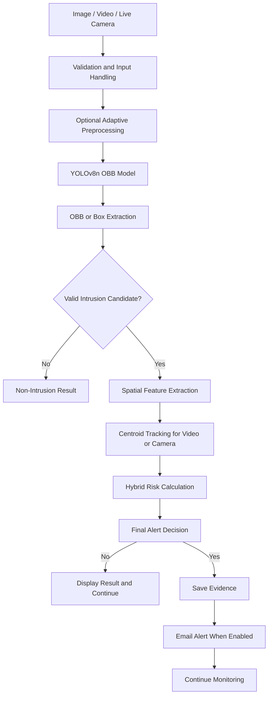

# Final Project Completion, Testing, Security, and Defence Report

## Project Title

**Hybrid Computer Vision Intrusion and Non-Intrusion Detection System for Homes and Retail Shops**

## Report Date

**09 July 2026**

## 1. Final Status

The project source code, model files, configuration, web routes, hybrid decision logic, video processing, simulated live-camera processing, evidence handling, tests, and defence documentation were reviewed.

### Completion result

| Area | Status |
|---|---|
| Project structure and required files | Completed and verified |
| Python dependencies | Installed and verified |
| Model checkpoint loading | Completed and verified |
| OBB result extraction | Completed and verified |
| Image-upload workflow | Completed and tested |
| Video-upload workflow | Completed and tested |
| Live-camera software workflow | Completed and tested with a simulated camera |
| Physical webcam test | Requires a computer with an attached camera |
| Hybrid risk and decision rules | Completed and tested |
| Alert screenshot logic | Completed and tested safely |
| Email configuration handling | Completed and tested safely |
| Real email delivery | Requires valid SMTP credentials and explicit permission |
| Threshold consistency | Audited and improved |
| Security review | Completed; user-side credential rotation is still required if old credentials were exposed |
| Project defence material | Included in this report |
| ROI, night vision, WhatsApp, database, and multi-camera | Correctly identified as future work |

The software is ready for local demonstration after the user completes three environment-dependent checks:

1. Connect and test the real webcam.
2. Add fresh SMTP credentials and run the opt-in email test.
3. Test with labelled intrusion and normal CCTV samples from the intended home or shop.

---

# 2. Work Completed

## 2.1 Dependency and environment verification

The packages listed in `requirements.txt` were installed and checked, including:

- Flask
- Ultralytics
- OpenCV
- NumPy
- python-dotenv
- PyTorch
- Requests
- Pytest

The project was then compiled with Python to check for syntax errors.

### Result

```text
Python compilation: Passed
```

---

## 2.2 Automated test suite

The complete safe test suite was executed after the code improvements.

### Result

```text
27 passed
2 skipped
0 failed
```

The two skipped tests are intentionally protected live-email tests. They do not send an email unless this environment variable is explicitly enabled:

```env
ALLOW_LIVE_EMAIL_TEST=1
```

This protection prevents accidental email delivery during normal testing.

### Main areas covered by tests

- High-confidence intrusion decisions
- Medium-confidence hybrid decisions
- Non-intrusion decisions
- Confidence thresholds
- Risk calculation
- Highest-risk detection selection
- Regular bounding-box extraction
- Oriented bounding-box extraction
- Empty regular boxes with valid OBB output
- Model checkpoint presence
- Email configuration safety
- Email trigger modes
- Web-file presence
- Complete synthetic hybrid pipeline
- Central configuration validity
- Simulated live-camera processing

---

## 2.3 Model checkpoint verification

The verification script confirmed:

```text
Project verification passed.
best.pt archive label: best
last.pt archive label: last
Best supplied epoch: 15
Best supplied mAP50-95: 89.419%
```

The supplied model contains one class:

```text
intrusion
```

Therefore:

```text
Valid intrusion detection found
        -> Intrusion candidate

No valid intrusion detection found
        -> Non-Intrusion result
```

`non-intrusion` is not a separately trained neural-network class.

---

## 2.4 Training-result verification

The supplied `training/results.csv` was analysed.

| Metric | Best supplied result |
|---|---:|
| Epoch | 15 |
| Precision | 98.508% |
| Recall | 97.248% |
| mAP50 | 98.353% |
| mAP50–95 | 89.419% |
| Validation box loss | 0.38114 |
| Validation class loss | 0.26760 |
| Validation DFL loss | 1.11769 |
| Validation angle loss | 0.00684 |

These results describe the supplied validation set. They do not guarantee the same accuracy for every new home, shop, camera position, lighting condition, or person.

---

# 3. End-to-End Workflow Testing

## 3.1 Web routes

The Flask test client was used to test the main routes.

| Route | Result |
|---|---:|
| `/` | 200 OK |
| `/api/model-info` | 200 OK |
| `/api/email-trigger-status` | 200 OK |
| `/api/email-trigger-modes` | 200 OK |
| `/get-detections` | 200 OK |
| `/detect-image` | 200 OK |
| `/detect-video` | 200 OK |

The main page, JSON APIs, image result page, and video result page were produced successfully.

---

## 3.2 Image-upload workflow

A real sample photograph was uploaded through the Flask image route.

### Model result

```text
Detections: 1
Class: intrusion
Confidence: 28.7%
Detection type: OBB
Bounding rectangle: [392, 591, 789, 778]
```

### Final decision

The model confidence passed the image detector threshold of 25%, so the candidate was extracted and displayed. However, it did not reach the review threshold of 45% or the direct-alert threshold of 80%.

```text
Final result: Non-Intrusion / No Alert
```

This confirms that detection and final alert decision are separate stages.

---

## 3.3 Video-upload workflow

A short MP4 video was created from repeated real-image frames and submitted through `/detect-video`.

### Result

```text
Video upload accepted: Yes
Video frames processed: Yes
Annotated MP4 created: Yes
Result page rendered: Yes
Alert sent: No
```

The low-confidence candidate did not satisfy the final alert rules, which was the correct result for this test.

---

## 3.4 Live-camera workflow

The execution environment did not provide a physical webcam. Attempting to open camera index `0` correctly returned:

```text
Could not open camera index 0.
```

To verify the software logic, a simulated camera test was added. It provided artificial frames to the real `CameraStream` class and used a fake high-confidence intrusion detector.

### Simulated-camera result

```text
Camera frame capture logic: Passed
Detection processing: Passed
Feature extraction: Passed
Tracking: Passed
Risk calculation: Passed
Final alert decision: Passed
Thread start and stop: Passed
```

The physical webcam must still be tested on the final demonstration computer.

---

# 4. Real-Image and Threshold Testing

Two real photographs were tested with the supplied checkpoint.

| Test image | Model result | Final meaning |
|---|---|---|
| Bus/street photograph | One 28.7% OBB candidate | Below final alert rules |
| Football photograph | No detection | Non-Intrusion result |

A threshold comparison was also performed on the first image:

| Detector threshold | Detections |
|---:|---:|
| 0.20 | 1 |
| 0.40 | 0 |

### Important conclusion

The supplied model did not produce a strong confirmed intrusion on these general-purpose photographs. This does not prove that the model is faulty because these images were not taken from its labelled intrusion dataset. It does show that real field testing is necessary.

A trustworthy positive field test cannot be completed without at least one known, labelled intrusion image or video from the intended CCTV environment.

### Required final field-test set

Use at least:

- 20 labelled intrusion images
- 20 labelled normal images
- 5 intrusion videos
- 5 normal videos
- Daytime and night-time samples
- Near and far subjects
- Partial obstruction samples
- Different camera angles

Record these outcomes:

| File | True label | Model confidence | Final result | Correct? | Notes |
|---|---|---:|---|---|---|
| Example 1 | Intrusion | 0.91 | Alert | Yes | Clear entry |
| Example 2 | Normal | 0.00 | No alert | Yes | Empty room |

Then calculate:

```text
True Positives
False Positives
True Negatives
False Negatives
Precision
Recall
F1-score
False-alert rate
Average alert delay
```

---

# 5. Exact Configuration and Threshold Audit

## 5.1 Active detection settings

| Setting | Current value | Purpose |
|---|---:|---|
| `IMAGE_CONF_THRESHOLD` | 0.25 | Minimum model result retained for images |
| `VIDEO_CONF_THRESHOLD` | 0.25 | Minimum model result retained for video |
| `LIVE_CONF_THRESHOLD` | 0.30 | Minimum model result retained for live camera |
| `IOU_THRESHOLD` | 0.40 | YOLO overlap filtering |
| `MAX_DETECTIONS` | 100 | Maximum detections per frame |
| `ENABLE_ADAPTIVE_PREPROCESSING` | false | Enables brightness and CLAHE processing |
| `VIDEO_FRAME_SKIP` | 2 | Processes every second video frame |

## 5.2 Final decision settings

| Setting | Current value | Purpose |
|---|---:|---|
| `INTRUSION_HIGH_CONFIDENCE` | 0.80 | Direct alert threshold |
| `INTRUSION_REVIEW_CONFIDENCE` | 0.45 | Minimum hybrid-review confidence |
| `INTRUSION_RISK_THRESHOLD` | 65 | Minimum supporting risk |
| `MINIMUM_PERSISTENCE_FRAMES` | 3 | Minimum processed frames for hybrid alert |

## 5.3 Camera settings

| Setting | Current value |
|---|---:|
| Camera index | 0 |
| Width | 640 |
| Height | 480 |
| Target FPS | 30 |
| Camera frame skip | 2 |
| JPEG quality | 78 |
| Camera flip | false |

## 5.4 Alert settings

| Setting | Current value | Meaning |
|---|---:|---|
| `EMAIL_TRIGGER_MODE` | `COOLDOWN_60` | Maximum one email per 60 seconds |
| `ALERT_COOLDOWN_SECONDS` | 60 | Prevents repeated screenshot/email attempts in video and camera loops |
| `SAVE_ALERT_SCREENSHOTS` | true | Saves evidence when an alert is approved |

## 5.5 Detection threshold versus alert threshold

These values perform different jobs:

```text
Detector threshold
    -> Decides whether a model candidate is kept for analysis.

Final alert threshold
    -> Decides whether the retained candidate is strong enough for an alert.
```

Example:

```text
Model confidence = 28.7%
Image detector threshold = 25%

Candidate is kept and shown.

Review threshold = 45%
High threshold = 80%

Final result is no alert.
```

---

# 6. Code Improvements Applied

## 6.1 Centralised video frame skipping

`VIDEO_FRAME_SKIP` was added to `DetectionConfig` and is now used through the central configuration instead of being read independently in `app.py`.

## 6.2 Consistent alert cooldown

The configured `ALERT_COOLDOWN_SECONDS` is now passed into uploaded-video processing as well as live-camera processing.

This removed the previous mismatch where video processing used a separate hardcoded ten-second value.

## 6.3 Screenshot setting is now respected

`SAVE_ALERT_SCREENSHOTS` is now passed to video and camera processing. When disabled, the system can continue its decision and email logic without creating a screenshot file.

## 6.4 Safer model-path handling

A relative `MODEL_PATH`, such as:

```env
MODEL_PATH=Models/best.pt
```

is now resolved relative to the project directory. The application can therefore be started from another working directory without losing the model path.

## 6.5 Stronger OBB extraction

The detector now prefers a non-empty OBB collection and falls back to regular boxes only when OBB results are unavailable.

This fixes the edge case where an empty `result.boxes` object could hide a valid `result.obb` result.

## 6.6 New regression tests

The following tests were added:

- Configuration consistency test
- Empty regular boxes with valid OBB output test
- Simulated live-camera pipeline test

---

# 7. Current Feature Verification

| Feature | Status | Verification |
|---|---|---|
| Image upload | Active | End-to-end route tested |
| Video upload | Active | End-to-end route tested |
| Live camera | Active in code | Simulated test passed; real hardware pending |
| YOLOv8 OBB | Active | Checkpoint and inference tested |
| OBB extraction | Active | Real and synthetic tests passed |
| Feature extraction | Active | Unit and integration tests passed |
| Centroid tracking | Active | Unit/integration and camera simulation passed |
| Risk calculation | Active | Tests passed |
| Final decision rules | Active | Threshold tests passed |
| Result image saving | Active | Verified |
| Processed video saving | Active | Verified |
| Alert evidence saving | Active | Logic verified |
| Email service | Implemented | Safe configuration tests passed |
| Live SMTP delivery | Not verified here | Requires fresh credentials and explicit opt-in |
| WhatsApp/Twilio | Pending | Do not present as completed |
| ROI/restricted zones | Future | Not implemented |
| Dedicated night vision | Future | Not implemented |
| Database and alert history | Future | Not implemented |
| Multiple cameras | Future | Not implemented |
| User login | Future | Not implemented |

---

# 8. Security Cleanup and Safety Review

## 8.1 Completed checks

The active project was scanned for hardcoded passwords, API keys, tokens, and old Twilio credentials.

### Result

```text
No hardcoded live credential was found in the active cleaned source code.
```

The configuration uses environment variables for:

- Email sender
- Email password
- Alert receiver
- Roboflow API key
- Roboflow workspace
- Roboflow workflow ID

The current credential fields in the clean environment template are empty.

## 8.2 Git protection

`.gitignore` excludes:

```text
.env
venv/
.venv/
__pycache__/
.pytest_cache/
*.log
runtime uploads
runtime results
runtime alerts
```

## 8.3 Distribution protection

The cleaned distribution package should contain:

```text
.env.example
.env.template
```

It should not contain the working `.env` file.

## 8.4 Required user-side action

Any Gmail, Twilio, or Roboflow credential that was previously copied into source code, screenshots, chats, shared archives, or public repositories should be considered exposed.

The account owner must:

1. Revoke the old Gmail app password.
2. Create a new Gmail app password.
3. Revoke or regenerate old Twilio credentials.
4. Revoke or regenerate the old Roboflow API key.
5. Put only the new values inside the local `.env` file.
6. Never upload `.env` to GitHub or submit it with the project archive.

Credential rotation cannot be performed by the application itself because it requires access to the owner’s external accounts.

---

# 9. Safe Email Completion Procedure

## 9.1 Add fresh credentials

Create a local `.env` from `.env.example` and fill:

```env
SMTP_SERVER=smtp.gmail.com
SMTP_PORT=587
SENDER_EMAIL=your_new_sender@gmail.com
SENDER_PASSWORD=your_new_gmail_app_password
ALERT_EMAIL=your_receiver@example.com
EMAIL_TRIGGER_MODE=COOLDOWN_60
```

## 9.2 Safe configuration test

Run:

```powershell
python test_email_setup.py
```

Expected result:

```text
SMTP configured: True
Trigger mode: COOLDOWN_60
No email was sent.
```

## 9.3 Explicit live email test

Only when ready:

### Windows PowerShell

```powershell
$env:ALLOW_LIVE_EMAIL_TEST="1"
pytest -q test_email.py
```

### Windows Command Prompt

```cmd
set ALLOW_LIVE_EMAIL_TEST=1
pytest -q test_email.py
```

After testing, remove the temporary permission variable.

---

# 10. Final Demonstration Procedure

## 10.1 Setup

```powershell
cd Intrusion-Detection-WSB-CCTV-Updated
python -m venv venv
venv\Scripts\activate
pip install -r requirements.txt
copy .env.example .env
python app.py
```

Open:

```text
http://127.0.0.1:5000
```

## 10.2 Demonstration order

### Step 1: Explain the model

Say:

> The system uses a one-class YOLOv8n OBB model trained to detect intrusion. Non-intrusion means that no candidate satisfied the final rules; it is not a second trained class.

### Step 2: Show model information

Open:

```text
http://127.0.0.1:5000/api/model-info
```

Show:

- Model task
- Class name
- Class count
- Device
- Detection threshold
- IoU threshold

### Step 3: Upload a normal image

Expected result:

```text
No qualifying intrusion
No alert
Result page displayed
```

### Step 4: Upload a labelled intrusion image

Expected result:

```text
OBB displayed
Confidence shown
Risk calculated
Final decision shown
Evidence saved when approved
Email sent when configured and cooldown allows
```

### Step 5: Upload a video

Show:

- Frame-by-frame analysis
- Tracking IDs
- Persistence
- Risk score
- Annotated output video
- Controlled alerting

### Step 6: Start the live camera

Show:

- Continuous stream
- Start and stop control
- Detection list
- Intrusion status
- Risk and decision information
- Alert cooldown

### Step 7: Explain future modules

Clearly state that these are not completed in the current stage:

- ROI/restricted zones
- Dedicated night vision
- WhatsApp notification
- Database history
- Multiple cameras
- Authentication

---

# 11. Project Defence Material

## 11.1 Problem statement

Homes and retail shops often depend on continuous human observation of CCTV screens. Human observers can become distracted, tired, or unable to monitor several cameras at the same time. Important short events may therefore be missed. The project provides automatic first-stage screening by detecting visual intrusion candidates and producing an alert only when the evidence satisfies the configured rules.

## 11.2 Main objective

To develop a web-based hybrid computer-vision system that can analyse images, recorded videos, and a live camera feed to detect possible intrusion, report non-intrusion when no valid candidate exists, reduce weak alerts through risk and persistence rules, save visual evidence, and send an optional email alert.

## 11.3 Specific objectives

1. Load and run a trained YOLOv8 OBB checkpoint.
2. Support image, video, and live-camera inputs.
3. Extract standard detection information from OBB output.
4. Calculate spatial features from each detection.
5. Track objects across video and camera frames.
6. Calculate a hybrid risk score.
7. Apply direct and hybrid alert rules.
8. Save annotated results and alert evidence.
9. Send controlled email alerts.
10. Prepare a design that can later support ROI and night vision.

## 11.4 Methodology

```text
Input acquisition
    -> Input validation
    -> Optional image preprocessing
    -> YOLOv8 OBB inference
    -> Detection extraction
    -> Spatial feature extraction
    -> Object tracking for multi-frame input
    -> Risk calculation
    -> Rule-based final decision
    -> Evidence saving
    -> Optional email alert
    -> Result display
```

## 11.5 System architecture



## 11.6 Why the project is hybrid

The system does not rely only on the neural-network confidence value. It combines:

- YOLO confidence
- Detection size
- Frame coverage
- Position
- Persistence
- Movement
- Area growth
- Rule-based risk thresholds

This provides more evidence before an alert is approved.

## 11.7 Final decision rules

```text
Confidence >= 80%
    -> Direct intrusion alert

Confidence >= 45%
Risk >= 65
Frames seen >= 3
    -> Hybrid intrusion alert

Otherwise
    -> No alert
```

A model candidate below the final thresholds may still be displayed, but it does not create an alert.

## 11.8 Main limitations

- One trained class only
- No identity recognition
- Non-intrusion is inferred from no qualifying result
- No ROI permission rules
- No dedicated night-vision module
- Basic centroid tracking
- Mainly one camera at a time
- No structured database
- Email depends on internet and SMTP setup
- Performance depends on the training-data distribution
- Validation metrics do not replace field testing

## 11.9 Future improvements

1. Add labelled day and night CCTV data.
2. Add restricted-zone polygons.
3. Add infrared or low-light camera support.
4. Replace centroid tracking with ByteTrack, BoT-SORT, or DeepSORT.
5. Add a database and alert-history dashboard.
6. Add multiple-camera and IP-camera support.
7. Add secure user authentication.
8. Complete WhatsApp or SMS notifications.
9. Optimise the model for an edge device.
10. Perform a formal field evaluation.

---

# 12. Important Viva Questions and Answers

## Q1. Why did you use YOLOv8 OBB?

YOLO provides fast object detection, while OBB supports rotated rectangles. This can describe angled objects more accurately than a normal axis-aligned rectangle.

## Q2. Is this a two-class model?

No. The model contains only the class `intrusion`. The application reports non-intrusion when no valid intrusion candidate satisfies the final rules.

## Q3. Why is the system called hybrid?

Because it combines deep-learning detection with handcrafted spatial features, object tracking, risk scoring, and rule-based decisions.

## Q4. Why not send an alert for every model detection?

Weak or temporary detections can be false positives. The final rules require high confidence or supporting risk and persistence before alerting.

## Q5. What is the difference between the detector threshold and alert threshold?

The detector threshold decides which model outputs are retained. The alert threshold decides which retained results are dangerous enough to notify the user.

## Q6. What happens at 70% confidence in a single image?

It does not create an alert under the current default rules because it is below 80% and a single image cannot provide the required three-frame persistence.

## Q7. What happens at 60% confidence in a video?

It can create a hybrid alert only when the risk score reaches at least 65 and the same tracked object persists for at least three processed frames.

## Q8. What does the tracker do?

It gives an ID to a detected object and records its position, frames seen, movement, and area changes across frames.

## Q9. Why use frame skipping?

Frame skipping reduces CPU load and improves speed. The limitation is that a very short event may occur during a skipped frame.

## Q10. Why are the validation metrics not enough?

They measure performance on the supplied validation data. A new home or shop may have different lighting, camera positions, backgrounds, and people.

## Q11. What happens when email fails?

The error is handled, the application continues running, and saved evidence remains available. Detection should not stop because SMTP failed.

## Q12. Is WhatsApp completed?

No. It is a planned extension and should not be presented as an active feature.

## Q13. Is night vision completed?

No. Basic optional preprocessing exists, but dedicated infrared or night-vision support is future work.

## Q14. Is ROI completed?

No. The current model analyses the full frame. User-defined restricted-zone logic is planned.

## Q15. What is the main ethical concern?

CCTV can capture residents, employees, customers, and visitors. Access control, limited retention, secure storage, legal compliance, and clear notice are necessary.

## Q16. What is the strongest current technical limitation?

The model has only one class and has not yet been formally evaluated on labelled real CCTV samples from the final deployment locations.

## Q17. What happens if there are several detections?

The system calculates risk for each detection and uses the highest-risk candidate for the main final decision.

## Q18. Why is email cooldown important?

A camera can process many frames each second. Without cooldown, one continuing intrusion could produce many repeated emails.

## Q19. Can this system prove that a scene is safe?

No. A non-intrusion result only means that no candidate satisfied the current model and decision rules.

## Q20. How would you make the project production-ready?

Add field testing, better tracking, ROI, night data, authentication, HTTPS, database logging, multiple alert channels, storage retention rules, and deployment monitoring.

---

# 13. Final Commands

## Run all safe tests

```powershell
pytest -q
```

Expected result for this completed version:

```text
27 passed, 2 skipped
```

## Verify project files and model checkpoints

```powershell
python final_verification.py
```

## Analyse training results

```powershell
python MODEL_ACCURACY_ANALYSIS.py
```

## Test an image directly

```powershell
python verify_fix.py path\to\image.jpg
```

## Compare model thresholds

```powershell
python test_threshold_comparison.py path\to\image.jpg --low 0.20 --high 0.40
```

## Start the web application

```powershell
python app.py
```

---

# 14. Final Submission Checklist

## Source and configuration

- [x] Main Flask application present
- [x] Service modules present
- [x] Frontend files present
- [x] Model checkpoints present
- [x] Training evidence present
- [x] `.env.example` present
- [x] `.gitignore` protects `.env`
- [x] No active hardcoded secrets found
- [x] OBB extraction verified
- [x] Configuration consistency improved

## Testing

- [x] Automated tests passed
- [x] Image route tested
- [x] Video route tested
- [x] Model loading tested
- [x] OBB inference tested
- [x] Simulated live-camera test passed
- [ ] Physical webcam tested on final computer
- [ ] Live SMTP delivery tested with fresh credentials
- [ ] Labelled home/shop CCTV field test completed

## Defence

- [x] Problem statement prepared
- [x] Objectives prepared
- [x] Methodology prepared
- [x] Architecture prepared
- [x] Model results prepared
- [x] Demonstration procedure prepared
- [x] Limitations prepared
- [x] Future work prepared
- [x] Viva questions prepared

---

# 15. Final Honest Conclusion

The project’s source code and safe software tests are complete. The image and video workflows run successfully, the OBB model loads correctly, the hybrid logic works, the web routes respond correctly, and the simulated camera pipeline passes. Configuration inconsistencies were corrected, stronger OBB extraction was added, and security protections were verified.

Three final deployment checks cannot be truthfully completed inside a tool environment without the user’s resources:

1. Testing the actual webcam connected to the demonstration computer.
2. Sending a real email with newly issued private SMTP credentials.
3. Measuring field performance with labelled intrusion and normal CCTV samples from the intended home or shop.

After those three user-side checks, the project can be treated as fully demonstrated and deployment-tested for the current capstone scope.

---

# ROI Update Completion

The project has been updated with ROI / restricted-zone monitoring support.

Completed work:

```text
Added ROI model files
Added ROI detector service
Added ROI geometry and matching logic
Updated image pipeline
Updated video pipeline
Updated live camera pipeline
Updated alert decision logic
Updated risk calculation
Updated frontend result display
Added ROI tests
Updated documentation
```

Safe test result after ROI update:

```text
34 passed
2 skipped
0 failed
```

The skipped tests are live-email tests that require explicit permission and valid private credentials.
