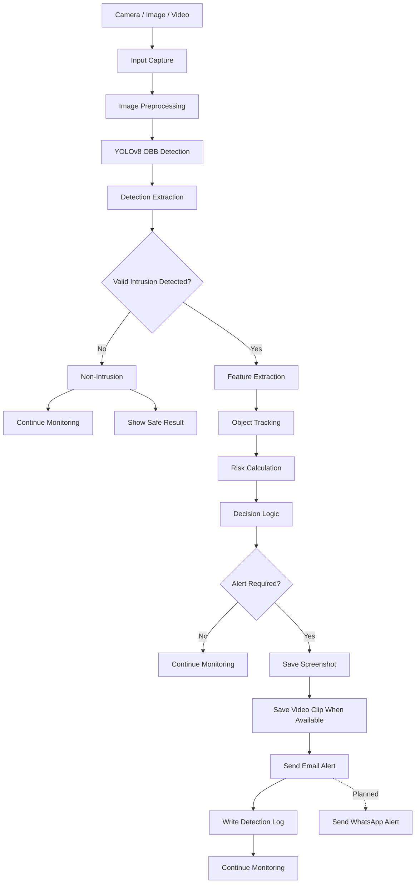
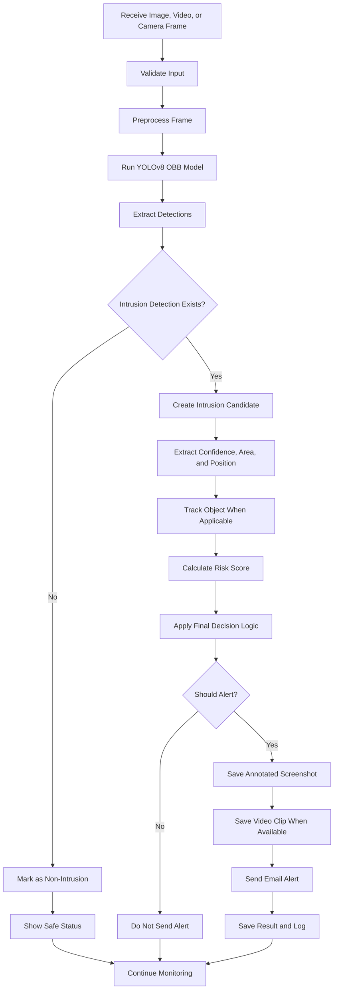

# Project File Explanation

## Project Title

**Hybrid Computer Vision Intrusion and Non-Intrusion Detection System for Homes and Retail Shops**

## Purpose of This Document

This document gives a short, clear explanation of every important file in the current project. It also explains the system design flow and the complete workflow from input to alert.

Generated folders such as `venv`, `__pycache__`, `.pytest_cache`, logs, uploaded media, and processed output files are not explained because they are created automatically while the project runs.

---

# Project Overview

The project accepts input from three sources:

- Image
- Uploaded video
- Live camera

The system uses a YOLOv8 Oriented Bounding Box model to detect intrusion. It then extracts features, tracks objects, calculates risk, applies decision rules, saves evidence, and sends an alert when required.

The current trained model contains one class:

```text
intrusion
```

Therefore, the system uses the following meaning:

```text
Valid intrusion detection found
        -> Intrusion

No valid intrusion detection found
        -> Non-Intrusion
```

The model does not contain a separate trained class named `non-intrusion`.

---

# System Design Flow



## System Design Explanation

### Input Capture

The system receives an image, video, or live camera frame.

### Image Preprocessing

The detector can improve brightness, contrast, and image detail before inference. This helps in dark or bright scenes.

### YOLOv8 OBB Detection

The trained YOLOv8 OBB model detects possible intrusion events and returns class, confidence, and oriented bounding-box data.

### Detection Extraction

The system converts the raw YOLO output into a standard structure that the rest of the application can use.

### Feature Extraction

The system calculates extra information such as area, position, center point, confidence, and danger level.

### Object Tracking

For live camera and video, the tracker follows the same detected object across frames and assigns an object ID.

### Risk Calculation

The system combines confidence, area, persistence, movement, and growth information to calculate a risk score.

### Decision Logic

The final rules decide whether the result should create an alert or continue monitoring.

### Alert Handling

For a confirmed intrusion, the system saves evidence, sends an email, writes a log, and continues monitoring.

WhatsApp alerting is planned but is not fully connected to the active pipeline.

---

# Complete Workflow



## Workflow Explanation

### Step 1: Receive Input

The system receives an image, uploaded video, or live camera stream.

### Step 2: Validate Input

The application checks whether the file or camera frame is available and readable.

### Step 3: Preprocess Input

The detector may adjust brightness and contrast, apply CLAHE, and reduce noise.

### Step 4: Run Model Inference

The YOLOv8 OBB model checks the scene for intrusion.

### Step 5: Extract Detection Data

The system reads the class name, confidence, bounding box, OBB polygon, center, and area.

### Step 6: Decide Intrusion or Non-Intrusion

A valid model detection becomes an intrusion candidate. If no valid detection exists, the result is treated as non-intrusion.

### Step 7: Extract Hybrid Features

The system adds area, position, risk, and other geometric information.

### Step 8: Track Objects

For live camera and video, the system tracks objects across frames to measure persistence and movement.

### Step 9: Calculate Risk

The risk calculator gives a score from 0 to 100 and helps select the most important detection.

### Step 10: Apply Decision Logic

The system checks confidence, risk, persistence, and the configured rules.

### Step 11: Perform Alert Actions

When the decision is positive, the system saves evidence, sends email, records the result, and continues monitoring.

---

# Input-Specific Workflows

## Image Workflow

```text
Upload Image
    -> Validate Image
    -> Preprocess Image
    -> Run YOLOv8 OBB Detection
    -> Extract Detection
    -> Calculate Features and Risk
    -> Apply Decision Logic
    -> Save Annotated Image
    -> Send Email if Alert Is Approved
    -> Show Result Page
```

An image has no long tracking history, so the alert decision depends more on model confidence and image-level risk.

## Video Workflow

```text
Upload Video
    -> Open Video
    -> Read Frames
    -> Process Selected Frames
    -> Run Detection
    -> Track Objects
    -> Calculate Risk
    -> Apply Decision Logic
    -> Write Annotated Output Video
    -> Save Alert Frame or Clip
    -> Send Email if Alert Is Approved
```

The video system processes frames, creates an output video, and records important detections.

## Live Camera Workflow

```text
Start Camera
    -> Capture Frames
    -> Skip Selected Frames for Performance
    -> Preprocess Frame
    -> Run Detection
    -> Track Objects
    -> Calculate Risk
    -> Apply Decision Logic
    -> Show Annotated Stream
    -> Save Screenshot and Clip
    -> Send Email if Alert Is Approved
    -> Continue Monitoring
```

The live camera runs continuously until the user stops it.

---

# Main Application Files

## `app.py`

This is the main Flask application. It starts the server, loads the model, defines routes, accepts image and video uploads, starts and stops the live camera, calls the detection pipeline, and sends data to the web pages.

## `requirements.txt`

This file lists the Python libraries required by the project. It is used to install all dependencies with:

```bash
python -m pip install -r requirements.txt
```

## `OPTIMIZATION_CONFIG.py`

This file stores the main settings for model thresholds, camera performance, preprocessing, risk rules, and alerts. It keeps configuration values in one place.

## `MODEL_ACCURACY_ANALYSIS.py`

This script reads the training result CSV file and prints the best precision, recall, mAP, and loss values.

## `final_verification.py`

This script checks whether the main files, models, labels, and training results exist and are valid.

## `verify_fix.py`

This manual script runs the current model on one image and prints the extracted OBB detection information.

## `debug_detector.py`

This script tests the complete detector class and prints the final detection dictionary produced by the application.

## `debug_yolo.py`

This script loads the YOLO model directly and shows the raw result structure, including `result.boxes` and `result.obb`.

## `email_trigger_control.py`

This command-line helper displays the active email trigger mode and available cooldown options.

---

# Environment and Repository Files

## `.env`

This is the private runtime configuration file. It stores model path, confidence values, camera index, server settings, and email credentials. It must not be uploaded publicly.

## `.env.example`

This is a safe sample configuration file. It shows the required environment variables without private values.

## `.env.template`

This is another reusable environment template for setting up the project on a new computer.

## `.gitignore`

This file tells Git to ignore private, generated, and unnecessary files such as `.env`, virtual environments, caches, logs, uploaded files, and results.

---

# Model Files

## `Models/best.pt`

This is the primary trained YOLOv8 OBB model. It achieved the best validation performance and should be used for normal detection.

## `Models/last.pt`

This is the model checkpoint from the last training epoch. It is mainly useful for comparison or continuing training.

---

# Training Files

## `training/args.yaml`

This file records the training configuration, including model type, task, dataset path, image size, batch size, epochs, optimizer, and augmentation settings.

## `training/data.example.yaml`

This is an example dataset configuration. It shows how training, validation, and test folders should be defined and confirms the `intrusion` class.

## `training/results.csv`

This file stores the result of every training epoch, including precision, recall, mAP, training loss, validation loss, and learning rates.

---

# Service Files

## `services/__init__.py`

This file makes the `services` folder a Python package so its modules can be imported.

## `services/detector.py`

This file contains the main `IntrusionDetector` class. It loads the YOLO model, preprocesses images, runs inference, handles regular and oriented bounding boxes, draws results, and returns structured detections.

## `services/feature_extractor.py`

This file calculates extra features from each detection, including area, area ratio, center position, border distance, confidence, and danger level.

## `services/risk_utils.py`

This file calculates the risk score. It combines confidence, area, persistence, movement, and growth, and selects the most important detection.

## `services/tracker.py`

This file tracks detected objects across frames. It assigns object IDs and stores position, history, frames seen, area changes, velocity, and disappearance count.

## `services/alert_decision_logic.py`

This file makes the final alert decision. It checks intrusion class, confidence, risk, and supporting information before returning alert status, type, score, and reason.

## `services/decision_engine.py`

This is a compatibility wrapper for older code. It allows old imports to use the current intrusion decision logic.

## `services/alert_service.py`

This file saves screenshots, controls email cooldown, creates the alert message, attaches evidence, and sends email through SMTP.

## `services/camera_utils.py`

This file manages the live server-side camera. It captures frames, runs detection, tracks objects, calculates risk, makes alert decisions, saves evidence, and provides the live stream.

## `services/video_utils.py`

This file processes uploaded videos. It reads frames, runs detection and tracking, writes the annotated video, saves evidence, and sends an alert when required.

## `services/roboflow_detector.py`

This is an optional Roboflow detector. It is not the primary detector because the project uses the local `Models/best.pt` file.

---

# Frontend Template Files

## `templates/index.html`

This is the main web page. It provides image upload, video upload, live-camera access, and basic system information.

## `templates/result.html`

This page displays the output of image and video detection, including annotated media, detections, risk score, alert status, and decision reason.

## `templates/live_camera.html`

This page shows the live camera feed, camera controls, current detection count, risk score, and recent intrusion information.

---

# JavaScript File

## `static/js/camera.js`

This file controls the live-camera page. It sends start and stop requests, refreshes the camera stream, polls detection information, and updates the page.

---

# Static Storage Files

## `static/uploads/.gitkeep`

This empty file keeps the uploads folder in Git. User-uploaded images and videos are saved in this folder during runtime.

## `static/results/.gitkeep`

This empty file keeps the results folder in Git. Annotated images and processed videos are saved here.

## `static/alerts/.gitkeep`

This empty file keeps the alerts folder in Git. Screenshots and alert evidence are stored here.

---

# Test Files

## `test_intrusion_logic.py`

This file tests the main intrusion decision rules, including high-confidence intrusion, non-intrusion, medium confidence, and threshold behavior.

## `test_alert_system.py`

This file tests alert decisions and alert-message generation.

## `test_decision_engine.py`

This file tests the compatibility `DecisionEngine` wrapper.

## `test_conf_threshold.py`

This file checks how different confidence levels affect the final alert decision.

## `test_detection_fix.py`

This file tests extraction from both normal bounding boxes and oriented bounding boxes.

## `test_extraction_fix.py`

This file reuses the extraction tests under the older test filename.

## `test_highest_confidence.py`

This file checks whether the risk calculator selects the strongest or most dangerous detection.

## `test_email_trigger.py`

This file tests email trigger modes and cooldown settings.

## `test_email_config.py`

This file checks how the alert service behaves when email credentials are missing.

## `test_email_setup.py`

This safe test checks whether email settings are complete without sending an email.

## `test_email.py`

This optional test sends a real email only when a permission variable is enabled.

## `test_image_alert.py`

This file tests alert behavior for a single uploaded image.

## `test_models.py`

This file checks whether `best.pt` and `last.pt` exist and match the expected checkpoint types.

## `test_full_system.py`

This file performs a safe integration test of feature extraction, risk calculation, decision logic, and required frontend files.

## `test_recent_img.py`

This manual test runs the current model on a selected image and prints detections.

## `test_threshold_comparison.py`

This manual test compares the number of detections produced by two confidence thresholds.

## `test_roboflow.py`

This file tests the optional Roboflow module and confirms that no private API key is hardcoded.

## `test_fire_detection_email.py`

This is a legacy filename kept for compatibility. It no longer performs fire detection and points to the intrusion email test.

## `test_intrusion_detection_email.py`

This optional test sends a real intrusion email only when explicit permission is enabled.

---

# Documentation Files

## `README.md`

This is the main project guide. It explains the project, setup process, installation, commands, routes, configuration, model behavior, testing, and limitations.

## `MIGRATION_NOTES.md`

This file explains how the old fire and smoke project was converted into the current intrusion project.

## `DETECTION_FIX_SUMMARY.md`

This file explains the OBB extraction issue and how support for `result.obb` fixed missing detection data.

## `OPTIMIZATION_GUIDE.md`

This file explains how to adjust confidence thresholds, frame skipping, preprocessing, risk rules, and camera performance.

## `QUICK_START_OPTIMIZATIONS.md`

This is a short guide for running the project with safe default optimization settings.

## `PROJECT_DEFENCE_REPORT.md`

This is the academic defence document. It explains the problem, objective, architecture, method, training evidence, system features, limitations, and future work.

## `system_design.md`

This file explains the structure of the full system. It describes every major layer, the relationship between components, the hybrid design, the alert process, and the current and planned features.

The main purpose of this file is to answer:

```text
What parts make up the system, and how are those parts connected?
```

## `workflow.md`

This file explains the order of operations from input to final alert. It covers image, video, live camera, model inference, tracking, risk, decision logic, evidence saving, and alerts.

The main purpose of this file is to answer:

```text
What happens step by step when the system receives an image, video, or camera frame?
```

---

# Difference Between System Design and Workflow

## System Design

System design explains the components and their connections.

Example:

```text
Input Layer
    -> Detection Layer
    -> Feature and Tracking Layer
    -> Risk and Decision Layer
    -> Alert Layer
```

## Workflow

Workflow explains the sequence of actions during actual operation.

Example:

```text
Receive Frame
    -> Run Model
    -> Check Intrusion
    -> Calculate Risk
    -> Decide Alert
    -> Save Evidence
    -> Send Email
```

---

# Planned Future Features

The current project can later be extended with:

- ROI configuration and restricted-zone monitoring
- Night-vision enhancement
- Authorized-person recognition
- Database storage
- Alert history dashboard
- WhatsApp integration
- Multiple camera support
- IP camera support
- User login and access control
- Production deployment settings

---

# Final Summary

The project is organized into five main parts:

1. The Flask application receives requests and controls the system.
2. The YOLOv8 OBB detector finds intrusion candidates.
3. Feature extraction, tracking, and risk calculation form the hybrid analysis layer.
4. Decision logic chooses between alert and no alert.
5. The alert service saves evidence and sends email.

`system_design.md` explains how the components are connected.

`workflow.md` explains how the system operates step by step.

---

# ROI Update Explanation

The ROI update adds a second model and ROI logic without removing the original intrusion model.

## New Model Files

```text
Models/roi_best.pt
Models/roi_last.pt
```

These files are used by `services/roi_detector.py`.

## New ROI Logic File

```text
services/roi_utils.py
```

This file checks whether a detected intrusion is inside a manual restricted zone or matched with ROI/person-context detections.

## Why This Was Added

Previously, the system detected intrusion in the whole frame. With ROI support, the system can focus on important areas such as:

```text
cash counter
storage room
main entrance
staff-only area
balcony
doorway
```

## Current Safe Behaviour

By default, ROI adds extra context but does not block the old alert system:

```text
REQUIRE_ROI_FOR_ALERT=false
```

To make ROI mandatory:

```text
REQUIRE_ROI_FOR_ALERT=true
```

---

# Updated ROI + Fuzzy Logic Explanation

The latest system uses this final logic:

1. The primary model checks intrusion.
2. If no intrusion is detected, no alert is generated.
3. If intrusion is detected, the system checks the intrusion bounding box against the restricted ROI.
4. If the bounding box does not enter ROI, no ROI alert is generated.
5. If it enters ROI, the ROI/person-context model result goes to fuzzy logic.
6. Fuzzy logic checks abnormal person, covered person, normal person, weapon, background, or unknown class.
7. Final alert decision is generated.

New file:

```text
services/fuzzy_logic.py
```

Main modified files:

```text
services/alert_decision_logic.py
services/roi_utils.py
services/camera_utils.py
services/video_utils.py
app.py
templates/result.html
templates/live_camera.html
static/js/camera.js
```
