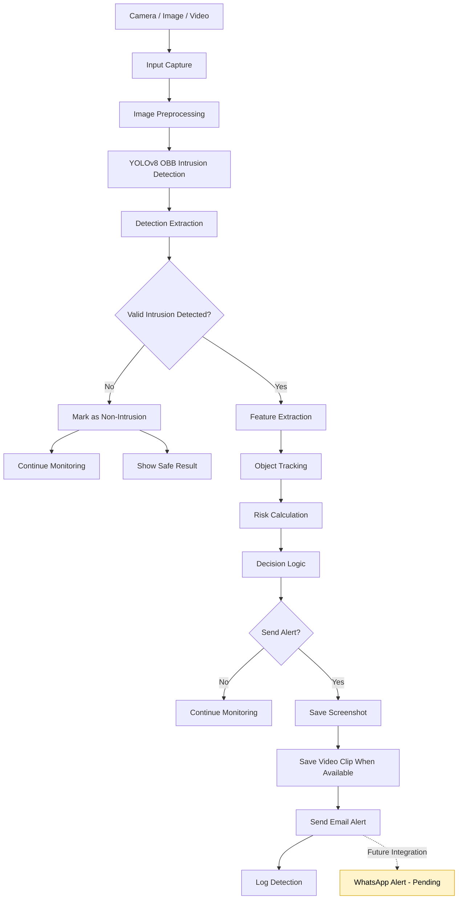

# System Design

## Project Title

**Hybrid Computer Vision Intrusion and Non-Intrusion Detection System for Homes and Retail Shops**

## 1. Purpose

The system monitors homes and retail shops through images, uploaded videos, and a live camera feed. It uses a YOLOv8 Oriented Bounding Box model, feature extraction, object tracking, risk scoring, and rule-based decision logic to detect intrusion events and decide whether an alert is required.

The current trained model contains one class:

- `intrusion`

The system therefore interprets results as follows:

- **Intrusion:** A valid intrusion detection is found.
- **Non-Intrusion:** No valid intrusion detection is found.

## 2. Main Architecture



## 3. Input Layer

### 3.1 Image Input

The user uploads a JPG, JPEG, or PNG image. The system performs one-time detection and displays an annotated result.

### 3.2 Video Input

The user uploads a video. The system processes selected frames, saves an annotated output video, and checks whether an alert is required.

### 3.3 Live Camera Input

The system captures frames from a connected camera. It performs continuous detection, object tracking, monitoring, and alert decisions.

## 4. Preprocessing Layer

Before model inference, the system may apply:

- Brightness estimation
- Automatic brightness and contrast adjustment
- CLAHE contrast enhancement
- Noise reduction

These steps help the model work in bright, normal, and low-light scenes. Dedicated night-vision support belongs to a later project phase.

## 5. Detection Layer

The system uses a YOLOv8 OBB model.

For every detected intrusion, the model can provide:

- Class name
- Confidence score
- OBB polygon
- Axis-aligned rectangle for display
- Detection center
- Bounding-box area

The detector supports both:

- `result.boxes`
- `result.obb`

OBB support is required because the current model uses oriented bounding boxes.

## 6. Hybrid Computer Vision Layer

The project is hybrid because it combines deep learning with handcrafted computer vision features, tracking, risk scoring, and decision rules.

### 6.1 Deep Learning Detection

YOLOv8 detects possible intrusion events.

### 6.2 Feature Extraction

The system calculates:

- Confidence
- Bounding-box area
- Area ratio
- Object center
- Preliminary intrusion type
- Danger level

### 6.3 Object Tracking

For live monitoring, the centroid tracker maintains:

- Object ID
- Current centroid
- Previous positions
- Frames seen
- Area history
- Movement information

### 6.4 Risk Calculation

The risk module combines information such as:

- Model confidence
- Detection area
- Object persistence
- Growth or movement

The risk score helps rank detections and supports the final decision.

### 6.5 Decision Logic

The current logic follows these rules:

1. A non-intrusion result does not generate an alert.
2. An intrusion result must pass the configured confidence rule.
3. High-risk uncertain detections may use fallback rules.
4. Only a positive final decision activates the alert service.

The current positive intrusion threshold is above 80% confidence unless the configuration is changed.

## 7. Alert Layer

When the final decision is positive, the system can:

- Save an annotated screenshot
- Save a short live-camera or video clip when available
- Send an email alert
- Save the processed result
- Write detection information to application logs

### Notification Status

| Notification | Status |
|---|---|
| Email alert | Implemented |
| WhatsApp alert | Planned / pending active integration |

WhatsApp should not be described as complete until it is connected to the active pipeline and tested.

## 8. Output Layer

The system produces:

- Annotated image
- Annotated video
- Live camera stream
- Detection class
- Confidence score
- Risk score
- Alert decision
- Alert reason
- Saved screenshot or clip
- Email notification when enabled

## 9. Main Software Components

| Component | Responsibility |
|---|---|
| `app.py` | Flask routes and application control |
| `services/detector.py` | YOLO model loading and inference |
| `services/feature_extractor.py` | Detection feature calculation |
| `services/tracker.py` | Object tracking |
| `services/risk_utils.py` | Risk calculation |
| `services/alert_decision_logic.py` | Final alert decision |
| `services/alert_service.py` | Screenshot and email alert handling |
| `services/video_utils.py` | Uploaded-video processing |
| `services/camera_utils.py` | Live-camera processing |
| `templates/index.html` | Main dashboard |
| `templates/result.html` | Image and video result display |
| `templates/live_camera.html` | Live monitoring page |

## 10. Current Scope

The completed first phase covers:

- Image intrusion detection
- Video intrusion detection
- Live-camera intrusion detection
- OBB result extraction
- Intrusion and non-intrusion decision
- Live object tracking
- Risk scoring
- Email alerts
- Screenshot and processed-video storage

## 11. Planned Extensions

- Dedicated night-vision support
- ROI or restricted-zone monitoring
- Authorized and unauthorized person recognition
- Active WhatsApp alerts
- Structured database logging
- Alert history dashboard
- User authentication
- Multiple-camera support
- IP camera and CCTV stream support
- Deployment hardening

---

# ROI System Design Update

The updated architecture adds an ROI/person-context branch after the primary intrusion detection step.

```text
Input frame
    -> Primary intrusion detector
    -> Secondary ROI/person-context detector
    -> Manual ROI zone analyzer
    -> Inside/outside ROI check
    -> Hybrid risk calculation
    -> Alert decision logic
```

The uploaded secondary model is kept separate from the primary intrusion model:

```text
Primary model: Models/best.pt
ROI model:     Models/roi_best.pt
```

The ROI analyzer supports manual restricted zones through `.env` and can also use model-detected ROI/context objects.

---

# Updated ROI + Fuzzy Logic Design

The ROI module is now placed after the primary intrusion detector.

```text
IntrusionDetector
    -> intrusion bounding box
    -> ROIAnalyzer
    -> FuzzyIntrusionLogic
    -> AlertDecisionLogic
    -> AlertService
```

The fuzzy module uses the ROI/person-context model output and checks whether the detected class is abnormal person, covered person, normal person, weapon, background, or unknown.
