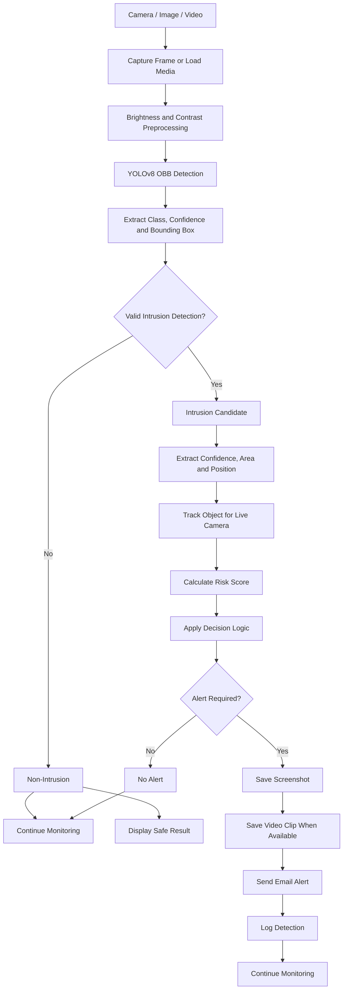
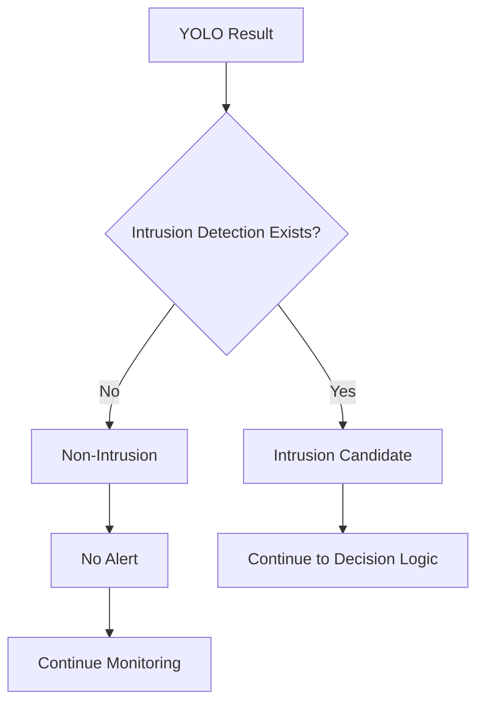
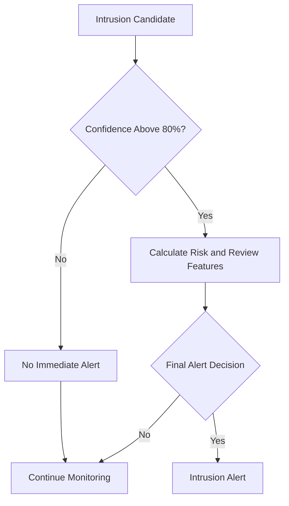
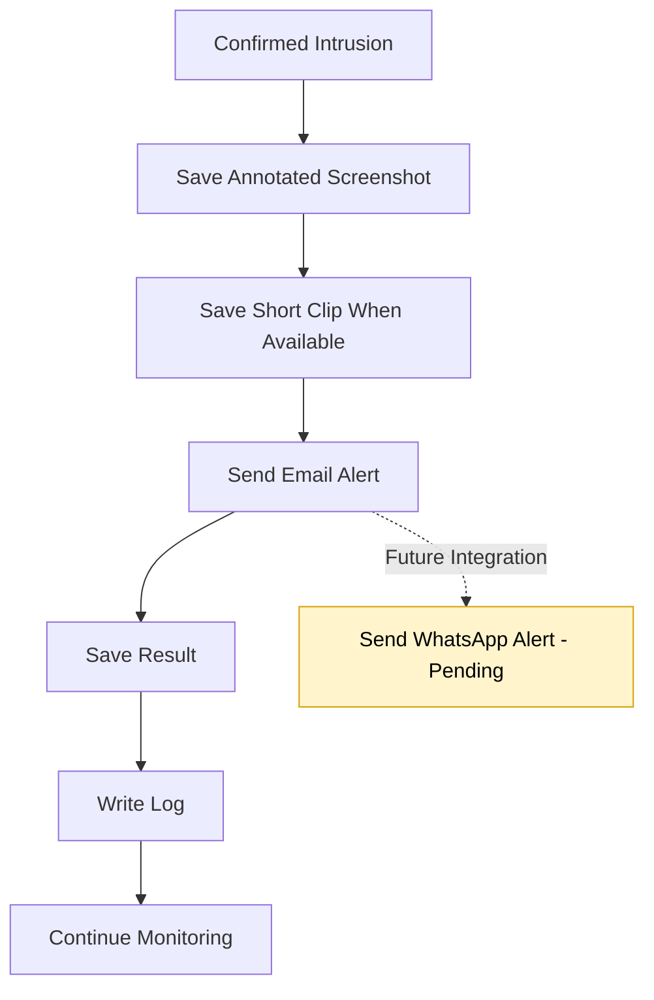
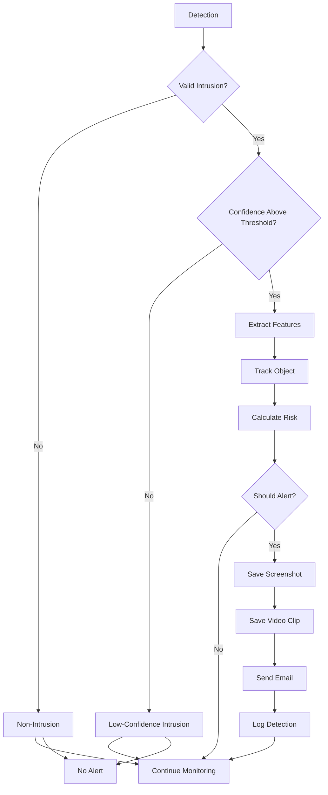

# Workflow

## 1. Main Project Workflow



## 2. Current Model Interpretation

The current model has one class:

```text
intrusion
```

Because there is no separate trained `non-intrusion` class, the system uses this interpretation:

```text
Valid intrusion detection found
        → Intrusion

No valid intrusion detection found
        → Non-Intrusion
```

## 3. Detailed Workflow

### Step 1: Receive Input

The system receives one of the following:

- Uploaded image
- Uploaded video
- Live camera frame

### Step 2: Preprocess Input

The detector may:

- Estimate scene brightness
- Adjust brightness and contrast
- Apply CLAHE
- Reduce image noise

### Step 3: Run YOLO Detection

The YOLOv8 OBB model analyzes the input and returns:

- Intrusion class
- Confidence score
- OBB polygon
- Bounding coordinates

### Step 4: Extract Detection Data

The system supports both normal and oriented bounding-box outputs.

For each detection, it extracts:

- Class name
- Model class
- Confidence
- Bounding box
- Box area
- Area ratio
- Center point

### Step 5: Determine Intrusion or Non-Intrusion



### Step 6: Extract Hybrid Features

For a valid intrusion candidate, the system calculates:

- Confidence
- Area percentage
- Position
- Danger level
- Persistence
- Movement
- Growth information when available

### Step 7: Track the Object

For live-camera input, the tracker assigns an object ID and updates it across frames.

This helps the system understand whether the detection:

- Persists
- Moves
- Disappears
- Changes size

### Step 8: Calculate Risk

The risk calculator scores the intrusion candidate using model and tracking information. It also helps select the most important detection when several objects appear.

### Step 9: Apply Final Decision Logic



The confidence threshold can be changed in the project configuration.

### Step 10: Perform Alert Actions



## 4. Input-Specific Workflows

### 4.1 Image Workflow

```text
Upload Image
    ↓
Preprocess Image
    ↓
YOLO OBB Detection
    ↓
Intrusion Found?
    ├── No  → Show Non-Intrusion Result
    └── Yes → Calculate Features and Risk
                  ↓
             Apply Decision Logic
                  ↓
             Save Annotated Image
                  ↓
             Send Email if Alert Is Approved
```

### 4.2 Video Workflow

```text
Upload Video
    ↓
Read Video Frames
    ↓
Process Selected Frames
    ↓
YOLO OBB Detection
    ↓
Select Important Intrusion Detection
    ↓
Calculate Features and Risk
    ↓
Apply Decision Logic
    ↓
Write Annotated Output Video
    ↓
Save Alert Frame or Clip
    ↓
Send Email if Alert Is Approved
```

### 4.3 Live-Camera Workflow

```text
Start Camera
    ↓
Capture Frames
    ↓
Skip Selected Frames for Performance
    ↓
Preprocess Frame
    ↓
YOLO OBB Detection
    ↓
Track Detected Object
    ↓
Calculate Features and Risk
    ↓
Apply Decision Logic
    ↓
Show Annotated Live Stream
    ↓
Save Screenshot and Short Clip
    ↓
Send Email if Alert Is Approved
    ↓
Continue Monitoring
```

## 5. Final Decision Logic



## 6. Current and Planned Alert Channels

| Action | Current status |
|---|---|
| Save screenshot | Active |
| Save processed video | Active |
| Save short live-camera clip | Supported by live pipeline |
| Send email | Active when configured |
| Send WhatsApp | Pending active integration |
| Write log | Active |
| Save to database | Planned |

## 7. Future ROI Workflow

```text
Person Detection
    ↓
Track Person
    ↓
Check Person Position Against ROI
    ↓
Inside Restricted Zone?
    ├── No  → Continue Monitoring
    └── Yes → Check Permission
                  ↓
             Unauthorized?
                ├── No  → Continue Monitoring
                └── Yes → Trigger Intrusion Alert
```

## 8. Future Night-Vision Workflow

```text
Low-Light or Night Camera Input
    ↓
Night-Vision Enhancement
    ↓
Noise Reduction
    ↓
YOLO Intrusion Detection
    ↓
Tracking and Risk Calculation
    ↓
Decision Logic
    ↓
Alert Actions
```

---

# ROI Workflow Update

For each image, video frame, or live-camera frame:

```text
1. Run intrusion detection.
2. Run optional ROI/person-context detection.
3. Load manual ROI zones if configured.
4. Check whether intrusion bbox center or overlap is inside ROI.
5. Match intrusion detection with ROI context, such as covered person.
6. Add ROI fields to the detection.
7. Add ROI bonus to risk score when applicable.
8. Apply final decision logic.
```

Important ROI fields added to each detection:

```text
inside_roi
roi_status
roi_zone_name
roi_zone_source
roi_context_class
roi_person_alert
roi_overlap_ratio
```

If `REQUIRE_ROI_FOR_ALERT=true`, the final decision logic blocks alerts outside the monitored ROI.

---

# Updated ROI + Fuzzy Logic Workflow

```text
Input
    -> Primary intrusion model
    -> Intrusion detected?
        -> No: no alert
        -> Yes: extract intrusion bounding box
    -> Check bounding box against restricted ROI
        -> Outside ROI: no ROI alert
        -> Inside ROI: pass to fuzzy logic
    -> Fuzzy logic checks class/person type
        -> abnormal person
        -> covered person
        -> normal person
        -> weapon
        -> background
    -> Final alert decision
```

This means ROI is not checked before intrusion. ROI works as a validation step after intrusion detection.
